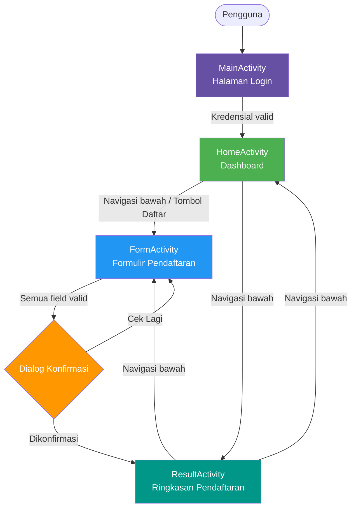

# SeminarApp

> Aplikasi Android yang bersih dan modern untuk melihat dan mendaftar seminar teknologi — dibangun dengan Kotlin dan Material 3.


-informational)

---

## Gambaran Umum

SeminarApp adalah aplikasi mobile Android yang memungkinkan pengguna untuk masuk dan mendaftar seminar teknologi di berbagai topik seperti AI, Keamanan Siber, Data Science, dan lainnya. Setelah mengisi formulir pendaftaran, pengguna langsung mendapatkan ringkasan konfirmasi dari data yang telah dikirimkan. Aplikasi ini menampilkan desain glassmorphism yang elegan dengan dukungan mode terang/gelap dan navigasi bawah yang mulus.

---

## Video Demo

[Tonton demo di YouTube](https://youtu.be/ZYWeKgv9F5A)

---

## Fitur

- **Halaman Login Aman** — validasi format email (wajib `@gmail.com`) dengan pesan kesalahan langsung secara real-time
- **Dashboard Beranda Personal** — menyapa pengguna yang sedang login dengan nama mereka dan akses cepat ke pendaftaran
- **Formulir Pendaftaran Seminar** — mengumpulkan nama, email, nomor HP, jenis kelamin, dan pilihan seminar dengan validasi lengkap di sisi klien
- **Seminar Tersedia** — AI Seminar, Mobile Development, Cyber Security, Data Science, UI/UX Design
- **Dialog Konfirmasi** — menampilkan pratinjau data sebelum pendaftaran dikirim
- **Halaman Hasil** — menampilkan ringkasan pendaftaran yang telah selesai
- **Navigasi Bawah** — navigasi tiga tab yang persisten (Beranda / Formulir / Hasil)
- **Mode Terang & Gelap** — pergantian tema otomatis melalui Material 3 DayNight

---

## Teknologi yang Digunakan

| Kategori          | Teknologi                                       |
|-------------------|-------------------------------------------------|
| Bahasa            | Kotlin                                          |
| Framework UI      | Android SDK · AndroidX · Material 3 (DayNight) |
| Layout            | ConstraintLayout · LinearLayout                 |
| Tipografi         | Poppins (Regular, SemiBold, Bold)               |
| Sistem Build      | Gradle (Kotlin DSL)                             |
| Min / Target SDK  | API 33 (Android 13) / API 36                   |
| Pengujian         | JUnit · Espresso                                |

---

## Diagram Arsitektur



---

## Pengaturan & Instalasi

### Prasyarat

| Kebutuhan                    | Versi                    |
|------------------------------|--------------------------|
| Android Studio               | Hedgehog atau lebih baru |
| JDK                          | 11+                      |
| Perangkat Android / Emulator | API 33 (Android 13+)     |

### Langkah-langkah

**1. Clone repositori**

```bash
git clone <url-repo-anda>
cd SeminarApp
```

**2. Buka di Android Studio**

```
File → Open → pilih folder SeminarApp
```

**3. Sinkronisasi dependensi Gradle**

Android Studio akan meminta secara otomatis, atau jalankan:

```bash
./gradlew build
```

**4. Jalankan aplikasi**

Hubungkan perangkat fisik (aktifkan USB debugging) atau mulai emulator, lalu tekan **Run ▶** di Android Studio, atau:

```bash
./gradlew installDebug
```

**5. Masuk dengan akun uji coba**

| Field    | Nilai             |
|----------|-------------------|
| Email    | `grace@gmail.com` |
| Password | `123456`          |

> **Catatan:** Aplikasi saat ini menggunakan kredensial yang dikodekan secara statis untuk keperluan demonstrasi. Ganti logika autentikasi di `MainActivity.kt` dengan backend atau integrasi Firebase Anda sendiri sebelum digunakan di lingkungan produksi.
